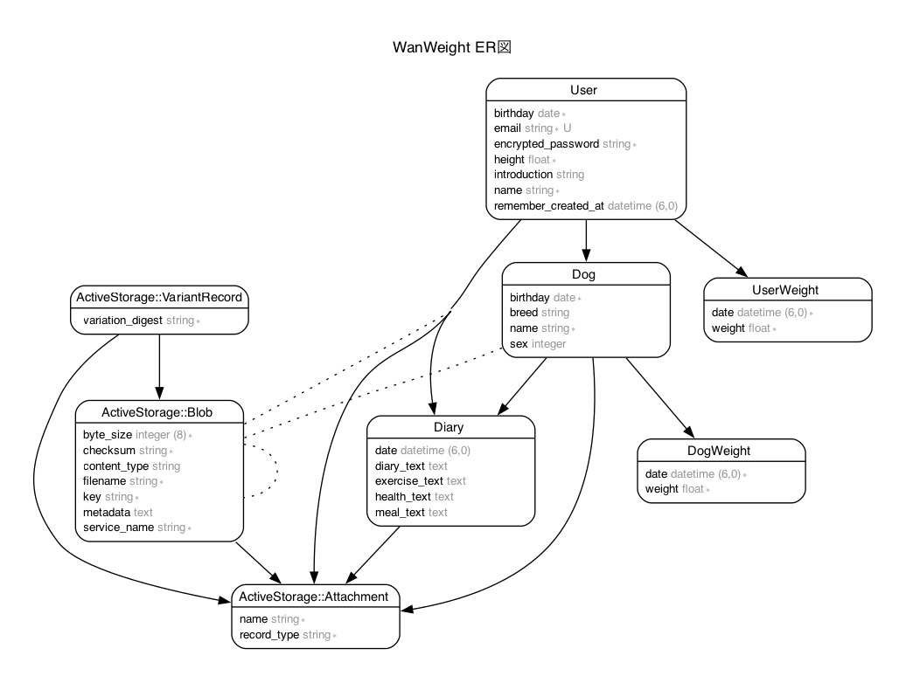

# *WanWeight*
**飼い主と愛犬が一緒に体重を測り、記録・管理するためのWEBアプリケーションです。** \
 

 

## アプリケーションURL
https://wan-weight-b2644868dcf6.herokuapp.com/ 
ゲストログインボタンから、メールアドレスとパスワードを入力せずにログインできます。 \
 

## アプリ名に込めた想い
"人間と犬の体重を一緒に管理することで\
1つの家族だということを認識し\
健康に生きることの重みを意識してほしい" \
 

## 開発背景
**「ペットの健康のためには体重を把握していないとダメだよ。」** 

これは仕事で動物病院を訪問した時に獣医師の先生に言われた言葉です。
私自身、犬を飼っていて、愛犬の健康には気をつけていましたが、体重を自分で測ったことはありませんでした。
犬を抱いて測った体重と、人間だけの体重を引くことで犬の体重を出す簡単なやり方だったので、その日から始めました。

体重管理を始めて気がついたのは、愛犬だけでなく自分自身の体重についても意識するようになったことです。
飼い主としての責任を果たすためには、自分自身も健康に気をつけないといけない。そんな意識が芽生えました。

このサービスを作ったのは、人間と犬の体重を一緒に管理するアプリケーションを自分自身が必要としていること。
そして犬と暮らす人々に、一緒に体重を測ることで、一緒に生きていることを意識してほしいと願っているからです。\
 

## 技術スタック
|  カテゴリー  |  使用技術  |
| ---- | ---- |
|  フロントエンド |  HTML, Tailwind CSS, Alpine.js  |
|  バックエンド  |  Ruby 3.1.4, Ruby on Rails |
|  データベース |  PostgreSQL |
|  テスト |  RSpec, Rubocop |
|  インフラ |  Heroku, Amazon S3 | \
 

## システム構成図
 
 

## ER図
 
 

## 機能要件
- ユーザー登録機能
- ゲストログイン機能
- ログイン/ログアウト機能
- ユーザー情報の表示/編集機能
- 体重の登録機能
- 登録した体重のグラフ化
- 日記機能
- 適正体重との比較機能
- カレンダー機能
 

## 使用イメージ
### ●体重を記録
**ユーザーと愛犬の体重を計測し、それぞれ記録します。記録した体重はグラフで表示されます。** 
 
 
 

### ●日記をつける
**日々の出来事や食事、健康について日記をつけることができます。** 
 
 
 

### ●カレンダー
**ユーザーの体重、愛犬の体重、日記を登録すると、カレンダーにアイコンで表示されます。** 
 
 
 

## 今後の課題
**現在はパーソナルユースに特化したアプリケーションのため、愛犬の体重や日記などを他のユーザーと共有する機能を追加して、
愛犬家同士で犬の健康について語り合える場を提供したい。また、ドッグカフェ（食事）やドッグラン（運動）、動物病院（健康）を
検索する機能を追加することで、より食事/運動/健康に対する関心を高め、愛犬とのQOL向上に役立つのではと考えています。**  
 

**最後までご覧いただきありがとうございました。**  
 
